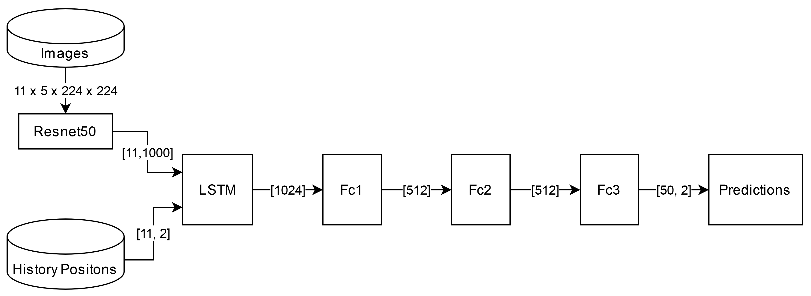
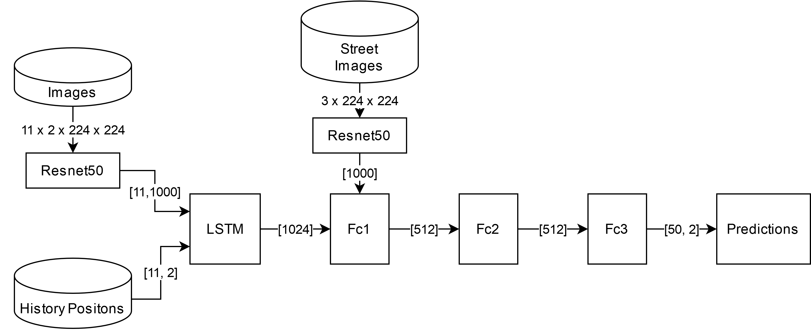
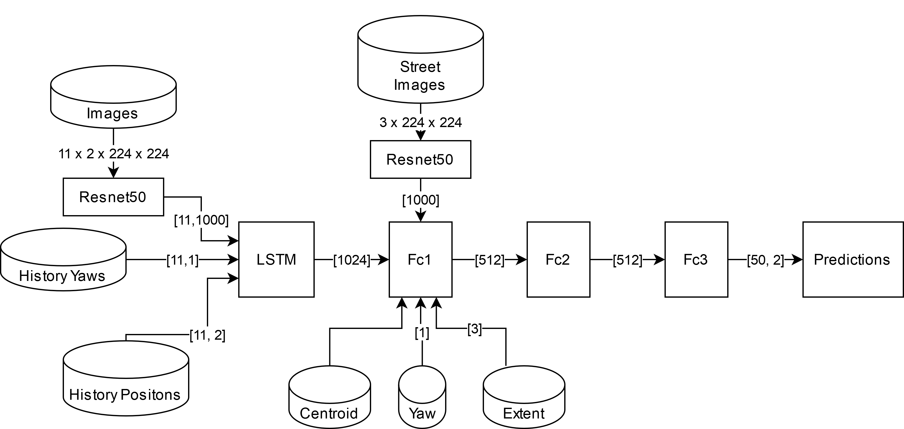
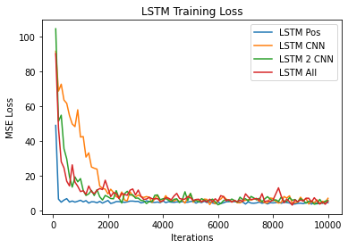
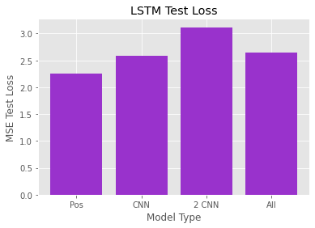
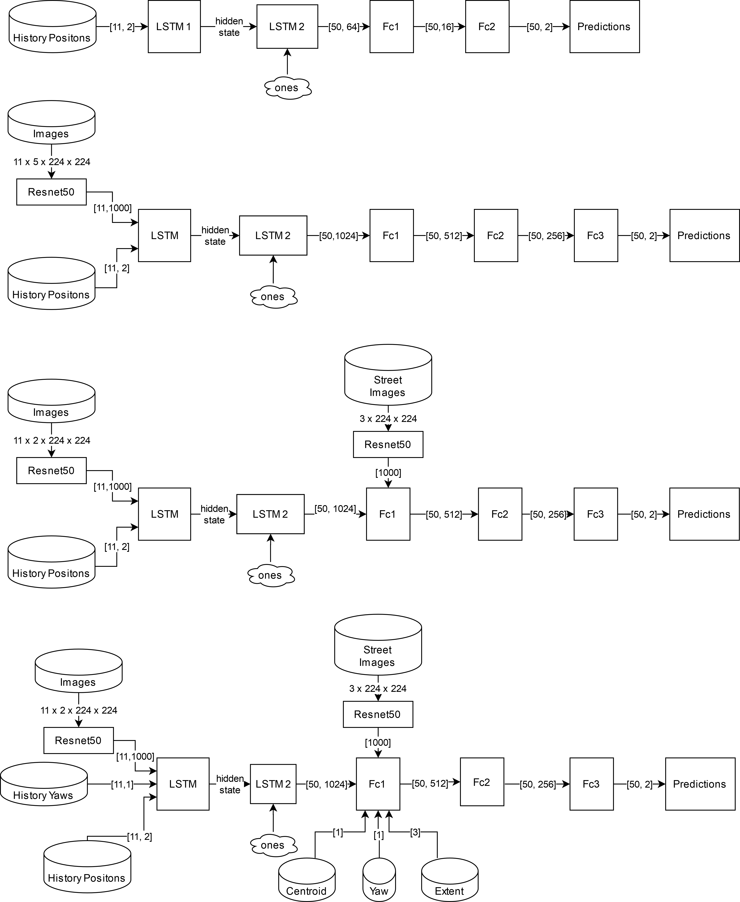
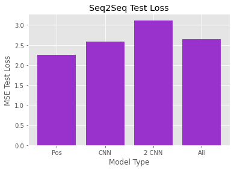

# LSTM and Seq2Seq LSTM model

We wanted to see how well a standard LSTM would perform and how adding more data to the architecture would affect its training performance. Lstm is one of the simplest recurrent models, allowing us to take advantage of temporal data in a simple, yet effective way. Our first LSTM architecture utilizes only the past 11 history positions of the given agent we are predicting trajectory for. By just using these positions, the model is able to get a sense of the speed of the vehicle given the constant time between all positions. 

Next, we assumed that adding more data would allow the model to get a better picture of the road conditions to use in predictions. As a result, we added a Resnet CNN to convert an image of the road and all nearby vehicles into a 1000 length vector encoding that would also be passed into the LSTM. With 11 past images of the road state from a bird’s eye view and the 11 historical positions, the model was able to figure out which parameters were most important and make predictions accordingly. Our dataset provided these images with 2 channels per history frame, 1 channel containing outlines of other agents, 1 containing the agent we are predicting for a total of 22 channels (2 * 11). In addition to these 22 channels, the dataset provided an RGB image containing the road information like lanes and traffic signal values. For this architecture, we tested by appending the road information image to the 2 channels (for a total of 5 channels per image) before passing it through the CNN. We also tested another architecture which had two separate CNNs, one for the 2 channel car information input and one with the 3 channel road information input.

Finally, we wanted to implement an LSTM architecture where we throw as much available data as possible. The intuition is to add all seemingly useful data and allow the model to figure out what input is actually important during training. As a result, these models might have performed better if trained for longer. We also found that this model trained better with a lower learning rate compared to the models described above, likely due to having so many input parameters. 

All of these LSTM variations performed well, quickly being able to stabilize and achieve a decent loss. Interestingly, the models with these least parameters required to learn seemed to be most stable whereas the more complicated variations like using all available data (LSTM All) performed well but had many spikes in average training loss. In this case, LSTM using only positional data achieved the best MSE test loss, though I assume with more training time the other models could also achieve similar loss. 

Given the success of these architectures, we wanted to see if we could apply the Seq2Seq architecture using the same general structure. As a result, we developed four similar models, replacing the single LSTM from the previous models with an encoder and decoder LSTM. The encoder took in the temporal input from our dataset. The decoder took in the last hidden state from the encoder and predicted the next 50 positions of the agent. We also tested a variation in which only the last decoder output was used to make the prediction, putting the output through a fully connected layer and predicting 50 time steps at once. This variation achieved decent accuracy though still performed worse than the standard Seq2Seq implementation.
 

Interestingly, while the position only variant of the base LSTM performed the best of the 4 architectures, the double CNN Seq2Seq variation performed the best among the Seq2Seq LSTM models, achieving an MSE test loss of 2.29. It was exciting to see Seq2Seq’s ability to perform well in the trajectory prediction domain, despite it often being thought of as a tool for text-based predictions, especially translations. While Seq2Seq performance is still around the level of the LSTM’s performance, we consider that with more tuning and training, it might be able to surpass it.

