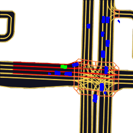
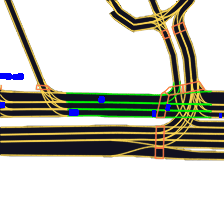
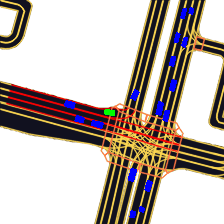
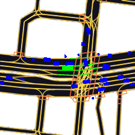
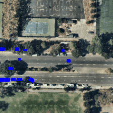
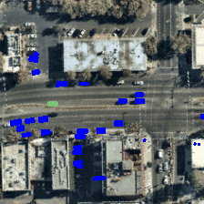
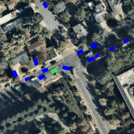
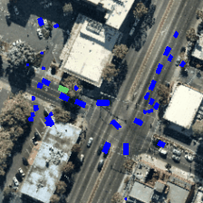

# Lyft5 Motion Prediction for Autonomous Vehicles

## Introduction
The Lyft l5kit dataset includes over 1000 hours of agent information. Given agent information from the last 10 time steps, we will try to predict the trajectory of the next 50 timesteps. Below are small gifs featuring 50 timesteps, the same amount of timesteps we have designed our model to be able to predict. With the help of past trajectory information, birds eye view images, and more, we were able to successfully train our models to make reasonable predictions on future trajectories of agents in the scene.

## Semantic Map Examples

# Satellite Map Examples

    

## Project Structure

    .
    ├── Models                  # Source code for ALL developed models
    ├── build                   # Compiled files 
    ├── public                  # Metdata files
    └── src                     # Source files for blog page
